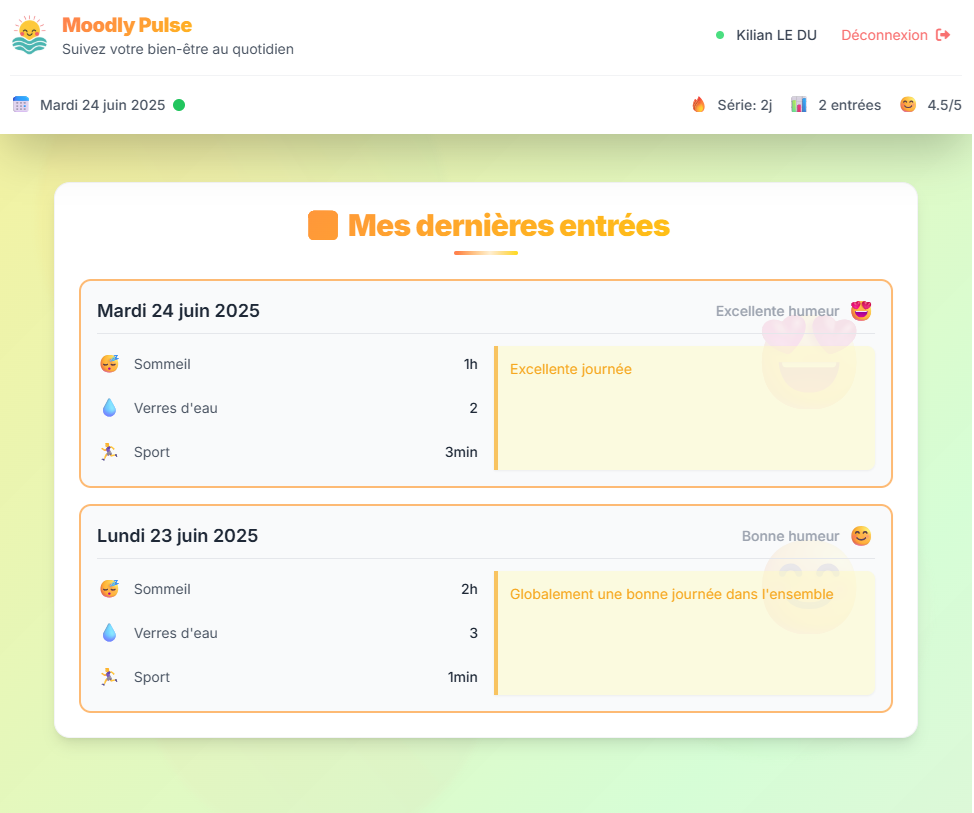

# 💖 MoodlyPulse

**Application de suivi quotidien de santé et bien-être**

MoodlyPulse est une application complète permettant de suivre quotidiennement votre humeur, sommeil, hydratation et activité physique. L'application offre une interface moderne et intuitive pour gérer vos données de bien-être avec des statistiques détaillées.

## 🎯 Fonctionnalités principales

- **📊 Suivi quotidien** : Enregistrez votre humeur, sommeil, hydratation et sport
- **📈 Statistiques** : Visualisez vos tendances et progrès
- **🔐 Authentification sécurisée** : Comptes utilisateurs avec JWT
- **📱 Interface responsive** : Optimisée pour mobile, tablette et desktop
- **🎨 Design moderne** : Interface intuitive avec Tailwind CSS

## 📚 Documentation

### 🔧 Backend
- **[README principal Backend](backend/README.md)** - Vue d'ensemble du Backend
- **[Documentation technique](backend/DOC.md)** - Structure, API, modèles
- **[Guide de démarrage](backend/START.md)** - Installation et configuration

### 🎨 Frontend
- **[README principal Frontend](frontend/README.md)** - Vue d'ensemble du Frontend
- **[Documentation technique](frontend/DOC.md)** - Architecture, composants, services
- **[Guide de démarrage](frontend/START.md)** - Installation et configuration

## 🛠️ Technologies utilisées

### Backend
- **Go 1.20+** - Langage principal
- **Gin** - Framework web HTTP
- **GORM** - ORM pour Go
- **PostgreSQL** - Base de données
- **JWT** - Authentification

### Frontend
- **Angular 20** - Framework principal
- **TypeScript** - Langage de programmation
- **Tailwind CSS** - Framework CSS utilitaire
- **SCSS** - Préprocesseur CSS
- **RxJS** - Programmation réactive

## 🎨 Interface utilisateur

---

**MoodlyPulse** - Prenez soin de votre bien-être quotidien 💖 